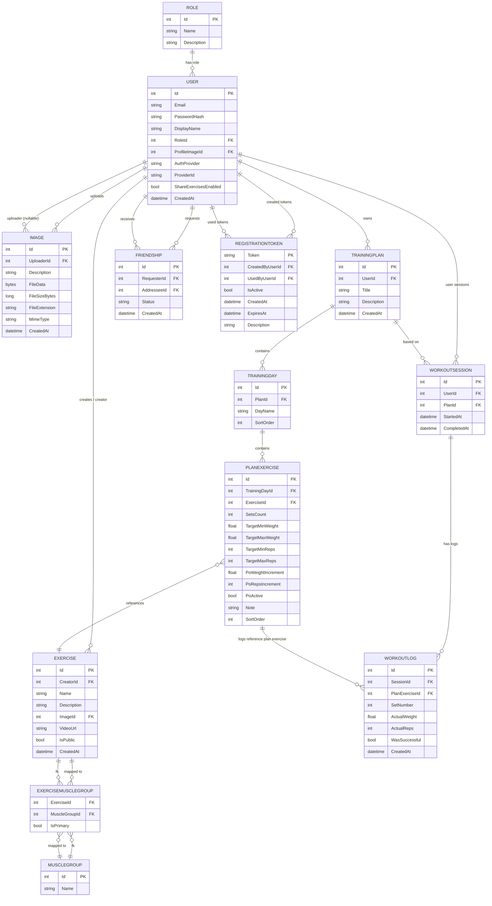

```mermaid
erDiagram
    USER {
        int Id PK
        string Email
        string PasswordHash
        string DisplayName
        int RoleId FK
        int ProfileImageId FK
        string AuthProvider
        string ProviderId
        bool ShareExercisesEnabled
        datetime CreatedAt
    }

    ROLE {
        int Id PK
        string Name
        string Description
    }

    IMAGE {
        int Id PK
        int UploaderId FK
        string Description
        bytes FileData
        long FileSizeBytes
        string FileExtension
        string MimeType
        datetime CreatedAt
    }

    EXERCISE {
        int Id PK
        int CreatorId FK
        string Name
        string Description
        int ImageId FK
        string VideoUrl
        bool IsPublic
        datetime CreatedAt
    }

    MUSCLEGROUP {
        int Id PK
        string Name
    }

    EXERCISEMUSCLEGROUP {
        int ExerciseId FK
        int MuscleGroupId FK
        bool IsPrimary
    }

    TRAININGPLAN {
        int Id PK
        int UserId FK
        string Title
        string Description
        datetime CreatedAt
    }

    TRAININGDAY {
        int Id PK
        int PlanId FK
        string DayName
        int SortOrder
    }

    PLANEXERCISE {
        int Id PK
        int TrainingDayId FK
        int ExerciseId FK
        int SetsCount
        float TargetMinWeight
        float TargetMaxWeight
        int TargetMinReps
        int TargetMaxReps
        float PoWeightIncrement
        int PoRepsIncrement
        bool PoActive
        string Note
        int SortOrder
    }

    WORKOUTSESSION {
        int Id PK
        int UserId FK
        int PlanId FK
        datetime StartedAt
        datetime CompletedAt
    }

    WORKOUTLOG {
        int Id PK
        int SessionId FK
        int PlanExerciseId FK
        int SetNumber
        float ActualWeight
        int ActualReps
        bool WasSuccessful
        datetime CreatedAt
    }

    FRIENDSHIP {
        int Id PK
        int RequesterId FK
        int AddresseeId FK
        string Status
        datetime CreatedAt
    }

    REGISTRATIONTOKEN {
        string Token PK
        int CreatedByUserId FK
        int UsedByUserId FK
        bool IsActive
        datetime CreatedAt
        datetime ExpiresAt
        string Description
    }

    %% Relationships
    USER ||--o{ EXERCISE : "creates / creator"
    USER ||--o{ IMAGE : "uploads"
    IMAGE }o--|| USER : "uploader (nullable)"

    ROLE ||--o{ USER : "has role"

    EXERCISE ||--o{ EXERCISEMUSCLEGROUP : "mapped to"
    MUSCLEGROUP ||--o{ EXERCISEMUSCLEGROUP : "mapped to"
    EXERCISEMUSCLEGROUP }o--|| EXERCISE : "fk"
    EXERCISEMUSCLEGROUP }o--|| MUSCLEGROUP : "fk"

    TRAININGPLAN ||--o{ TRAININGDAY : "contains"
    TRAININGDAY ||--o{ PLANEXERCISE : "contains"
    PLANEXERCISE }o--|| EXERCISE : "references"

    USER ||--o{ TRAININGPLAN : "owns"

    USER ||--o{ WORKOUTSESSION : "user sessions"
    TRAININGPLAN ||--o{ WORKOUTSESSION : "based on"
    WORKOUTSESSION ||--o{ WORKOUTLOG : "has logs"
    PLANEXERCISE ||--o{ WORKOUTLOG : "logs reference plan exercise"

    USER ||--o{ FRIENDSHIP : "requests"
    USER ||--o{ FRIENDSHIP : "receives"

    USER ||--o{ REGISTRATIONTOKEN : "created tokens"
    USER ||--o{ REGISTRATIONTOKEN : "used tokens"
```