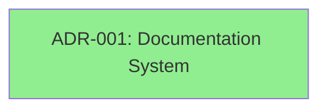
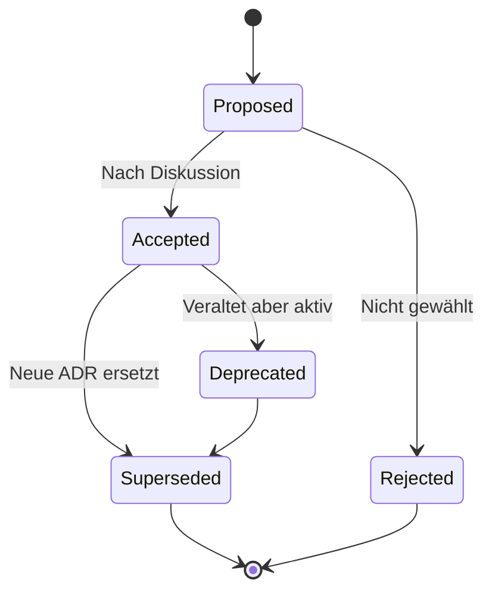

---
type: index
created: 2025-01-11
updated: 2025-01-11
tags: [adr, architecture, index, overview]
---

# 🏛️ Architecture Decision Records (ADRs)

> **Für Agents:** Lies zuerst `[[_meta]]` für ADR-Konventionen.

## Überblick

ADRs dokumentieren **wichtige Architektur-Entscheidungen** in diesem Projekt. Jede ADR beschreibt:
- **Warum** eine Entscheidung getroffen wurde (Kontext)
- **Was** entschieden wurde (Entscheidung)
- **Welche Alternativen** es gab
- **Welche Konsequenzen** daraus folgen

---

## Alle ADRs

| Nr. | Titel | Status | Bereich | Datum |
|-----|-------|--------|---------|-------|
| 001 | [[adr-001-documentation-system]] | ✅ accepted | documentation | 2025-01-11 |

_Weitere ADRs werden hier automatisch hinzugefügt._

---

## ADRs nach Status

### ✅ Accepted (1)
- [[adr-001-documentation-system]]

### 📝 Proposed (0)
_Noch keine vorgeschlagenen ADRs._

### ❌ Rejected (0)
_Noch keine abgelehnten ADRs._

### 🔄 Superseded (0)
_Noch keine ersetzten ADRs._

---

## ADRs nach Bereich

### Documentation (1)
- [[adr-001-documentation-system]]

### Architecture (0)
_Noch keine Architektur-ADRs._

### Security (0)
_Noch keine Security-ADRs._

### Data (0)
_Noch keine Daten-ADRs._

### Infrastructure (0)
_Noch keine Infrastruktur-ADRs._

---

## Timeline

```
2025-01 │ ● ADR-001: Documentation System
        │
2025-02 │ [Zukünftige ADRs]
        │
```

---

## ADR-Graph (Supersedes-Chain)



_Grün = accepted, Gelb = proposed, Rot = rejected, Grau = superseded_

---

## Wichtige ADRs für neue Entwickler

Wenn du neu im Projekt bist, lies zuerst diese ADRs:

1. **[[adr-001-documentation-system]]** – Wie wir dokumentieren
2. _Weitere werden folgen..._

---

## Wie erstelle ich eine neue ADR?

### Schritt-für-Schritt

1. **Prüfe Nummer:**
   ```bash
   # Nächste freie Nummer finden (aktuell: 002)
   ls autodocs/adrs/adr-*.md | tail -1
   ```

2. **Erstelle Datei:**
   ```bash
   # Nutze Template
   cp autodocs/templates/adr-template.md autodocs/adrs/adr-002-meine-entscheidung.md
   ```

3. **Fülle aus:**
   - Frontmatter mit Metadaten
   - Kontext, Entscheidung, Alternativen, Konsequenzen

4. **Verlinke:**
   - Setze Related-Links zu Features, Tests, anderen ADRs
   - Update diese Index-Datei

5. **Review:**
   - Status: `proposed` für Diskussion
   - Nach Akzeptanz: `accepted` + `decision_date`

### Quick-Template

```markdown
---
type: adr
number: 002
created: 2025-01-11
status: proposed
area: architecture
tags: [adr, architecture]
---

# ADR-002: Dein Titel

## Status
Proposed

## Kontext
[Situation & Problem]

## Entscheidung
[Was wird entschieden?]

## Alternativen
[Was wurde nicht gewählt?]

## Konsequenzen
### Positiv
- [Vorteile]

### Negativ
- [Trade-offs]

## Related
- [[related-link]]
```

---

## ADR-Lifecycle



---

## Statistiken

- **Total ADRs:** 1
- **Accepted:** 1 (100%)
- **Proposed:** 0 (0%)
- **Rejected:** 0 (0%)
- **Superseded:** 0 (0%)

_Letzte Aktualisierung: 2025-01-11_

---

## Tags-Übersicht

Häufig verwendete Tags:
- `#adr` – Alle ADRs (1)
- `#architecture` – Architektur-Entscheidungen (0)
- `#security` – Sicherheit (0)
- `#data` – Daten-Strategie (0)
- `#infrastructure` – Infrastruktur (0)

---

## Regeln & Best Practices

→ Siehe `[[_meta]]` für vollständige Konventionen

**Quick-Rules:**
- ✅ Jede wichtige Architektur-Entscheidung → ADR
- ✅ Niemals ADRs löschen, nur `status: superseded`
- ✅ Alternativen immer dokumentieren
- ✅ Konsequenzen vollständig (pos/neg/neutral)
- ✅ Related-Links setzen

---

## Related

- [[_meta]] – ADR-Konventionen & Regeln
- [[../templates/adr-template]] – Template für neue ADRs
- [[../guides/when-to-write-adr]] – Wann schreibe ich eine ADR?
- [[../index]] – Haupt-Navigation

[[../index]]
