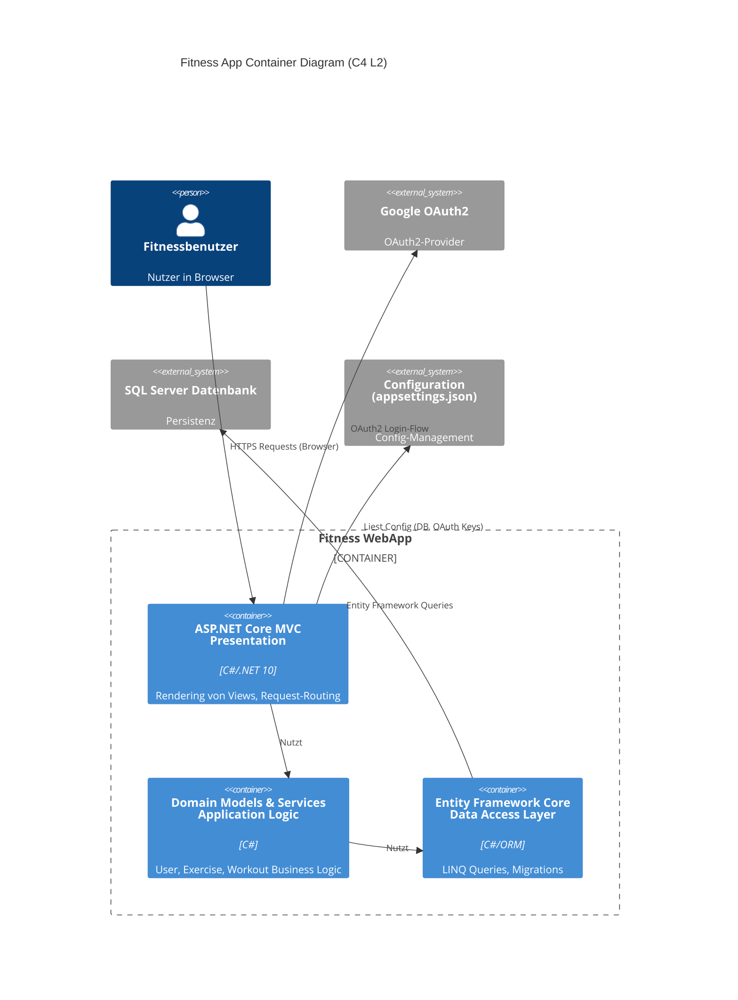
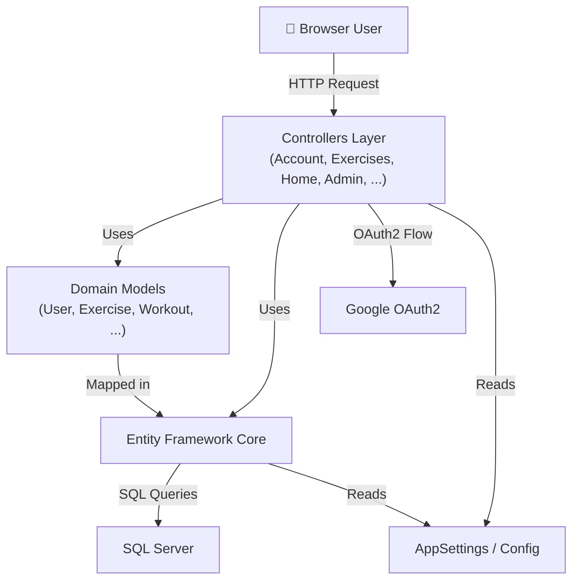
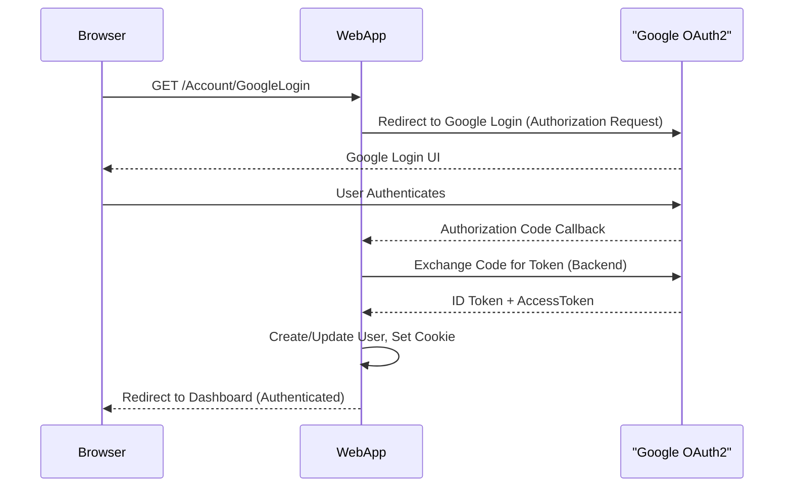

# Building Block View (C4 L2/L3)

## Einführung

Die Fitness WebApp folgt einer **Layered (3-Tier) Monolithic Architecture**:
- **Presentation Layer** (Views/Controllers)
- **Application/Domain Layer** (Models, Business Logic)
- **Persistence Layer** (Entity Framework, SQL Server)

Externe Dependencies: **Google OAuth2**, **AppSettings**

## System-Ebene Architektur (C4 L2)

## Module/Komponenten (C4 L3)

### 1. Presentation Layer (Controllers & Views)

| Komponente | Verantwortung | Quellpfad | Abhängigkeiten |
|---|---|---|---|
| **AccountController** | User Auth, Registration, Login, Logout, OAuth | `Source/Fitness/Controllers/AccountController.cs` | FitnessDbContext, IPasswordHasher |
| **ExercisesController** | Exercise CRUD | `Source/Fitness/Controllers/ExercisesController.cs` | FitnessDbContext |
| **HomeController** | Dashboard, Error Handling | `Source/Fitness/Controllers/HomeController.cs` | — |
| **AdminController** | Admin Functions | `Source/Fitness/Controllers/AdminController.cs` | FitnessDbContext |
| **MuscleGroupsController** | Muscle Group Management | `Source/Fitness/Controllers/MuscleGroupsController.cs` | FitnessDbContext |
| **ImagesController** | Image Upload/Management | `Source/Fitness/Controllers/ImagesController.cs` | FitnessDbContext, File System |
| **RegistrationTokensController** | Registration Token CRUD | `Source/Fitness/Controllers/RegistrationTokensController.cs` | FitnessDbContext |

**Views Location:** `Source/Fitness/Views/` (ASP.NET Razor Templates)

### 2. Domain Models (Application/Domain Layer)

| Modell | Verantwortung | Quellpfad | Persistiert |
|---|---|---|---|
| **User** | Benutzerkonto, Credentials | `Source/Fitness.DataAccess/Models/User.cs` | ✅ SQL Server |
| **Exercise** | Trainingsübung | `Source/Fitness.DataAccess/Models/Exercise.cs` | ✅ SQL Server |
| **Workout** | Trainingsplan/-session | `Source/Fitness.DataAccess/Models/Workout.cs` | ✅ SQL Server |
| **MuscleGroup** | Muskelgruppe (für Kategorisierung) | `Source/Fitness.DataAccess/Models/MuscleGroup.cs` | ✅ SQL Server |
| **Image** | Übungs-Bild | `Source/Fitness.DataAccess/Models/Image.cs` | ✅ SQL Server |
| **RegistrationToken** | Einladungs-Token | `Source/Fitness.DataAccess/Models/RegistrationToken.cs` | ✅ SQL Server |

**ViewModel Hierarchy:** `Source/Fitness/Models/ViewModels/` (für Server-Side Rendering)

### 3. Data Access Layer (Entity Framework Core)

| Komponente | Verantwortung | Quellpfad |
|---|---|---|
| **FitnessDbContext** | DbSet-Definitionen, Migrations | `Source/Fitness.DataAccess/FitnessDbContext.cs` |
| **Entity Mappings** | Fluent API Konfigurationen | `Source/Fitness.DataAccess/FitnessDbContext.cs` (OnModelCreating) |
| **EF Migrations** | Schema-Versioning | `Source/Fitness.DataAccess/Migrations/` |

### 4. Configuration & Infrastructure

| Komponente | Verantwortung | Quellpfad |
|---|---|---|
| **AppSettings** | Config-POCO mit Connection String, OAuth Keys | `Source/Fitness/Config/AppSettings.cs` |
| **appsettings.json** | Umgebungs-spezifische Settings | `Source/Fitness/Config/appsettings*.json` |
| **Program.cs** | DI-Container Setup, Middleware Configuration | `Source/Fitness/Program.cs` |

## Komponenten-Abhängigkeiten

## Cross-Cutting Concerns

| Concern | Implementation | Location |
|---|---|---|
| **Authentication** | Cookie + Google OAuth2 | `Program.cs` (ConfigureAuthentication) |
| **Authorization** | `[Authorize]` Attribute auf Controller-Actions | `Controllers/` |
| **Anti-CSRF** | `[ValidateAntiForgeryToken]` auf POST-Actions | `Controllers/` |
| **Error Handling** | Global exception/error pages | `Controllers/HomeController.cs` (Error Action) |
| **Configuration Management** | `AppSettings` POCO + Environment-specific JSON | `Config/`, `Program.cs` |

## External Component: Google OAuth2 Integration

## Quality Concerns pro Baustein

| Baustein | Performance | Security | Maintainability | Notes |
|---|---|---|---|---|
| **Controllers** | Synchronous Request/Response | CSRF, Authorization | MVC separation of concerns | Rate Limiting missing (GAP-001) |
| **Models** | Memory efficient | Property Validation | Clear POCO design | Consider Fluent Validation |
| **EF Core** | Connection Pooling enabled | Parameterized SQL (automatic) | ORM abstracts DB details | Migration ordering critical |
| **SQL Server** | Indexes needed on FK/PK | At-rest encryption not enforced (GAP-003) | Schema versioning via migrations | TDS protocol unencrypted (consider VPN) |
| **OAuth2 Integration** | Depends on Google SLA | Token storage in cookie secure | Minimal retry logic (GAP-002) | No circuit breaker pattern |

## Architecture Decision Records (ADRs)

Folgende ADRs beeinflussen diese Sicht:
- **ADR-001**: Entity Framework Core für ORM (vs. Dapper, NHibernate)

## Mapping: Code → Building Blocks

(Siehe auch `[[../architecture_mapping]]` für vollständiges Mapping)

| Code-Bereich | Baustein | Layer | Status |
|---|---|---|---|
| `Source/Fitness/Controllers/**` | Controllers | Presentation | ✅ Dokumentiert |
| `Source/Fitness/Models/**` | Domain Models | Application | ✅ Dokumentiert |
| `Source/Fitness.DataAccess/**` | EF Core + Models | Persistence | ✅ Dokumentiert |
| `Source/Fitness/Config/**` | Configuration | Infrastructure | ✅ Dokumentiert |
| `Source/Fitness/Program.cs` | DI & Middleware Setup | Infrastructure | ✅ Dokumentiert |
| `Source/Fitness/Views/**` | View Templates | Presentation | ⚠️ Minimal Docs |

---

## Navigation

[[index]] — Architektur-Übersicht
[[context_view]] — System Context
[[runtime_view]] — Runtime Behavior
