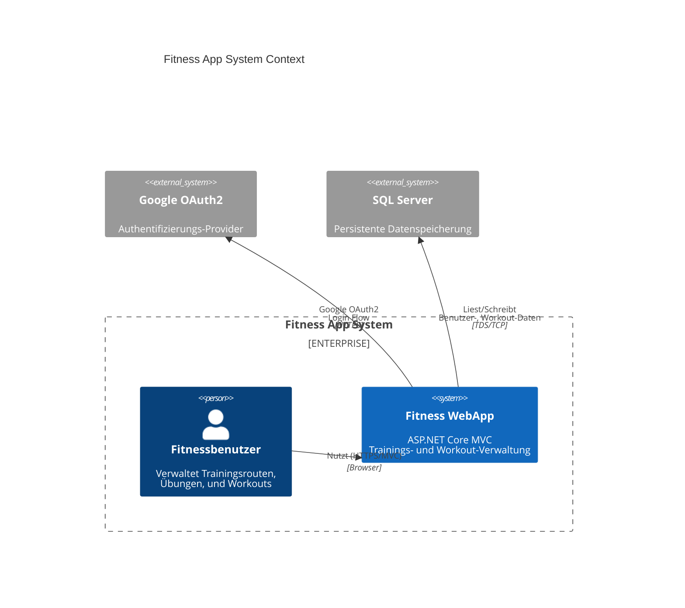

# System Context View

## Einführung

Die **Fitness WebApp** ist eine ASP.NET Core MVC-Webanwendung, die Benutzern ermöglicht, ihre Trainingsrouten zu verwalten. Sie integriert sich mit **Google OAuth2** für sichere Authentifizierung und speichert persistente Daten in **SQL Server**.

## System Context Diagram (C4 Level 1)

## Systemgrenzen

| Komponente | Verantwortlichkeit | Schnittstelle |
|---|---|---|
| **Fitness WebApp** | Zentrale Business logic, Authentifizierung, UI-Rendering | MVC-basierte HTTP-Endpoints, Session-Cookies |
| **Google OAuth2** | Sichere externe Authentifizierung | OAuth2 Authorization Code Flow |
| **SQL Server** | Persistente Datenspeicherung | Entity Framework Core + TDS Protocol |

## Benutzerrollen und Interaktionen

### 1. Fitnessbenutzer
- **Größte Rolle**: Registrierung, Login, Workout-Management
- **Interaktion:** Web-Browser
- **Authentifizierung:** Cookie (nach erfolgreicher Anmeldung) oder Google OAuth2
- **Workflows:**
  - Registrieren und Login
  - Workouts erstellen/bearbeiten/löschen
  - Übungen verwalten (CRUD)
  - Dashboard anzeigen

## Externe Abhängigkeiten

### Google OAuth2
- **Zweck:** Social Login, sichere Authentifizierung
- **Pattern:** OAuth2 Authorization Code Flow
- **Fehlerszenarien:** Network Timeout, Invalid Credentials, Rate Limits (nicht implementiert)

### SQL Server Database
- **Zweck:** Persistenz von Benutzerdaten, Trainingsrouten, Übungenhintzufügungen
- **Muster:** Entity Framework Core ORM
- **Fehlerszenarien:** Connection Loss, Query Timeout, FK Violations

## Schnittstellen und Kommunikationsprotokolle

| Schnittstelle | Protokoll | Format | Auth |
|---|---|---|---|
| Browser → WebApp | HTTPS | HTML Forms / Server-Side Rendering | Cookie-Session |
| WebApp → Google | HTTPS | OAuth2 + JSON | Client Credentials |
| WebApp → SQL Server | TDS (TCP) | Entity Framework Queries | SQL Server Auth |

## Systemverantwortlichkeiten

### Fitness WebApp
- User Registration & Password Hashing (local)
- Cookie-based Session Management
- Google OAuth2 Integration
- MVC View Rendering für UI
- Exercise & Workout CRUD
- Authorization (require authenticated user)

### Google OAuth2 (External)
- Verifiziert Benutzer-Identität
- Stellt Claims/Tokens bereit
- Verwaltet Credential-Sicherheit

### SQL Server (External)
- Speichert User, Exercise, Workout Entities
- Sichert Datenintegrität durch RDBMS-Constraints
- Bereitstellt ACID-Garantien

## Quality Concerns aus Kontext-Sicht

| Bereich | Anliegen | Mitigation |
|---|---|---|
| **Security** | Credentials sicher handhaben | UseSecrets, HTTPS, Hashing |
| **Availability** | OAuth-Fehler sollen nicht blocker sein | Fallback zu Local Auth |
| **Performance** | Datenbankverbindungen pooling | EF Core Connection String Pooling |
| **Maintainability** | Klare Separation of Concerns | MVC Pattern, layered architecture |

## Bestehende Architektur-Entscheidungen

1. **ADR-001: Entity Framework for Data Access** — ORM statt Raw SQL
2. **ADR-001: Obsidian-Compatible Documentation System** — Meta-Entscheidung für dieser Doku

## Related Documentation

- [[../blackbox/public/connections-overview]] — detaillierte Connections
- [[../blackbox/public/fitness-webapp-api]] — REST/MVC Endpoints
- [[../features/index]] — Feature-Dokumentation
- [[../adrs/index]] — Alle Architektur-Entscheidungen

---

## Navigation

[[index]] — Architektur-Übersicht
