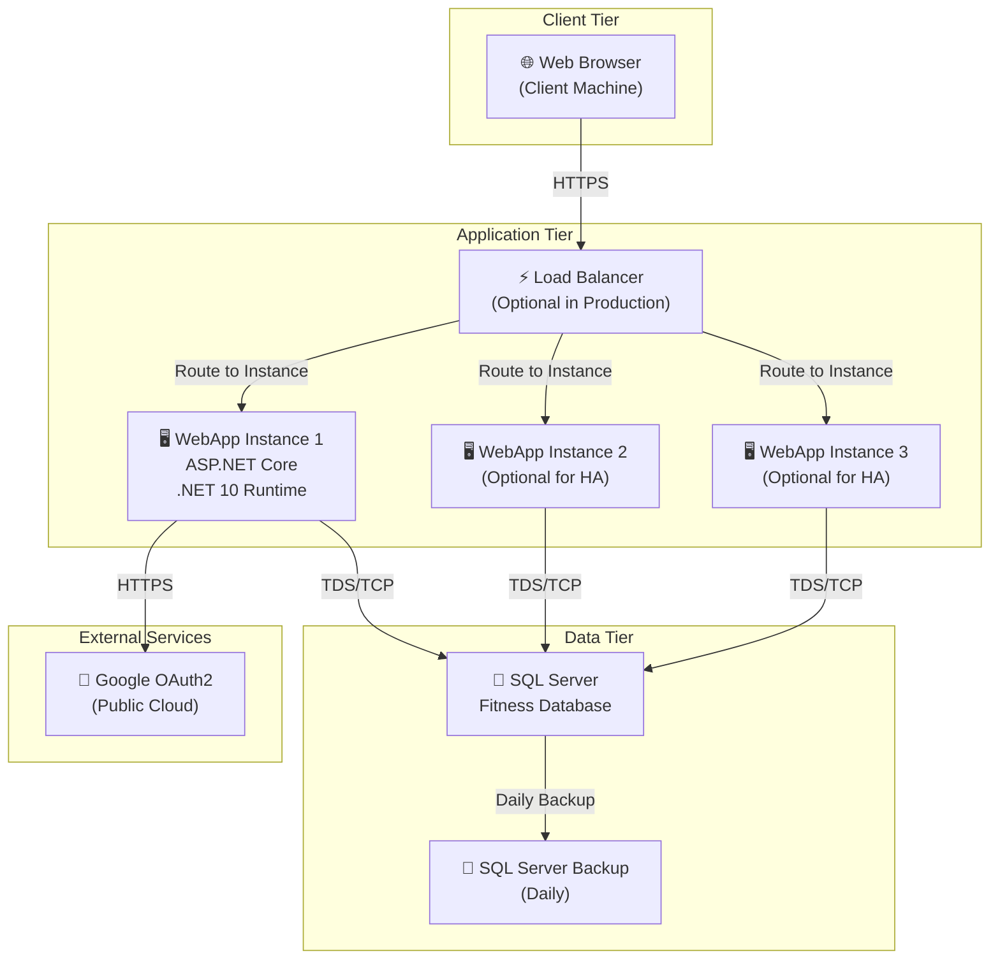

# Deployment View

## Einführung

Diese Sicht dokumentiert die Infrastruktur-Topologie: wie die Fitness WebApp deployed wird, auf welchen Nodes sie läuft, und wie sie mit Datastores und externen Services verbunden ist.

## Deployment Diagram (Logisch)



## Deployment-Modell

### Umgebungen

| Umgebung | Beschreibung | Zugriff | Daten |
|---|---|---|---|
| **Development** | Local/Docker auf Entwickler-Maschinen | nur Entwickler | Test-Daten |
| **Staging** | Vor Production, ähnliche Konfiguration | QA-Team | Snapshot von Production (anonymisiert) |
| **Production** | Public-facing, für echte Benutzer | Internet | Real user data (PII-sensitive) |

### Hosting & Nodes

**Application Server:**
- **OS:** Windows Server 2022 oder Linux (wenn containerisiert)
- **Runtime:** .NET 10 Runtime
- **Port:** 80 (HTTP, hinter Reverse Proxy), 443 (HTTPS von Client)
- **Process:** `dotnet run` oder via IIS Application Pool

**Database Server:**
- **OS:** Windows Server mit SQL Server 2022 (oder managed SQL in Azure)
- **Storage:** 500 GB+ (abhängig von Benutzer-Daten Volumen)
- **Network:** Private network segment (nicht internet-facing)
- **Port:** TCP 1433 (standard SQL Server, nur interne Verbindungen)

### Network Topology

```
┌─────────────────────────────────────────────────────────────┐
│                     Internet                                 │
└───────────┬─────────────────────────────────────────────────┘
            │ HTTPS (Port 443)
            │
            ▼
┌─────────────────────────────────────────────────────────────┐
│              Load Balancer / Reverse Proxy                   │
│         (Optional: Nginx, HAProxy, Azure Load Balancer)      │
└───────────┬─────────────────────────────────────────────────┘
            │
      ┌─────┴────────┐
      │              │
      ▼              ▼
  [App1]         [App2]    (HTTP 80 oder direct)
      │              │
      └─────┬────────┘
            │ Internal Network (Private VLAN)
            │ TDS/TCP (Port 1433)
            ▼
        [SQL Server]
            │
            ▼ (Backup)
        [Backup Storage]
```

## Storage-Strategie

| Storage | Zweck | Retention | Backup |
|---|---|---|---|
| **SQL Server DB** | Persistenz (Users, Exercises, Workouts) | Permanent | Daily incremental |
| **SQL Server Backup** | Disaster recovery | 30 Tage rolling | Offsite/Cloud |
| **Application Logs** | Troubleshooting | 7-30 Tage | Archive to blob storage |
| **Session State** | Distributed sessions (if needed) | Per-session TTL | N/A |

## Scaling & Load Distribution

### Horizontal Scaling
- **Application Tier:** 1-N Instanzen hinter Load Balancer
- **Database Tier:** SQL Server built-in HA (Availability Groups für Production)

### Load Balancer Konfiguration (Beispiel Nginx)
```
upstream fitness_app {
    least_conn;
    server app1.internal:80 weight=1;
    server app2.internal:80 weight=1;
    server app3.internal:80 weight=1;
    keepalive 32;
}

server {
    listen 443 ssl;
    server_name fitness.app;
    
    location / {
        proxy_pass http://fitness_app;
        proxy_set_header X-Real-IP $remote_addr;
    }
}
```

## Configuration Management

### Environment-spezifische Konfiguration

**Development:**
- `appsettings.Development.json`: Local SQL, Test Google OAuth keys
- Entity Framework: Automatic migrate on startup

**Staging:**
- `appsettings.Staging.json`: Staging SQL Server, Staging Google OAuth keys
- Database: Anonymisierte Production-Snapshot

**Production:**
- `appsettings.Production.json`: Production SQL, Live Google OAuth keys
- Secrets management: Azure KeyVault / AWS Secrets Manager
- Entity Framework: Manual migrations (not automatic)

### Secrets Management

- **Google OAuth Client ID/Secret:** Stored in KeyVault, not in appsettings.json
- **SQL Connection String:** Stored in KeyVault or managed service identity
- **Capsule:** Use `builder.Configuration.AddUserSecrets<Program>(true)` in Dev/Staging

## Security in Deployment

| Security Layer | Mechanism | Status |
|---|---|---|
| **Network** | Private subnet for DB, NACLs/Security Groups | ✅ Recommended |
| **TLS/SSL** | HTTPS for client communication, TDS encryption for DB | ✅ Enabled |
| **Authentication** | Cookie (local) + Google OAuth2 | ✅ Implemented |
| **Authorization** | [Authorize] attributes, Role-based (future) | ✅ Partial |
| **Database Encryption** | At-rest encryption (TDE for SQL Server) | ⚠️ GAP-003 (Not forced) |
| **Secrets** | No hardcoding, use KeyVault/Secrets Manager | ✅ Recommended |

## Monitoring & Observability

### Logging
- **Application Logs:** ASP.NET Core structured logging (Serilog recommended)
- **Database Logs:** SQL Server error log
- **Load Balancer Logs:** Request/response metrics

### Health Checks
```csharp
// Recommend adding to Program.cs:
app.MapHealthChecks("/health", new HealthCheckOptions { ... });
```

### Metrics to Monitor
- Request count & latency (p50, p95, p99)
- Database query time (slow query log)
- Connection pool utilization
- CPU, Memory, Disk I/O
- Authentication success/failure rates

## Disaster Recovery

| Scenario | RTO | RPO | Strategy |
|---|---|---|---|
| **App Server Crash** | < 5 min | 0 | Auto-restart via container orchestration or health check |
| **Database Failure** | < 30 min | 0 (transactional logs) | SQL Server Availability Groups / AlwaysOn |
| **Data Corruption** | < 1 hour | 24 hours | Restore from daily backup |
| **Ransomware** | < 4 hours | 1 day | Offline backups, immutable storage |

## Constraints & Assumptions

1. **SQL Server must be private network** — not internet-facing
2. **HTTPS required** for client communication
3. **Backup automation** is NON-NEGOTIABLE for production
4. **Load Balancer** should perform health checks every 5-10 seconds
5. **Secrets not stored in code** — all config externalized

---

## Navigation

[[index]] — Architektur-Übersicht
[[context_view]] — System Context
[[constraints]] — Technical Constraints
