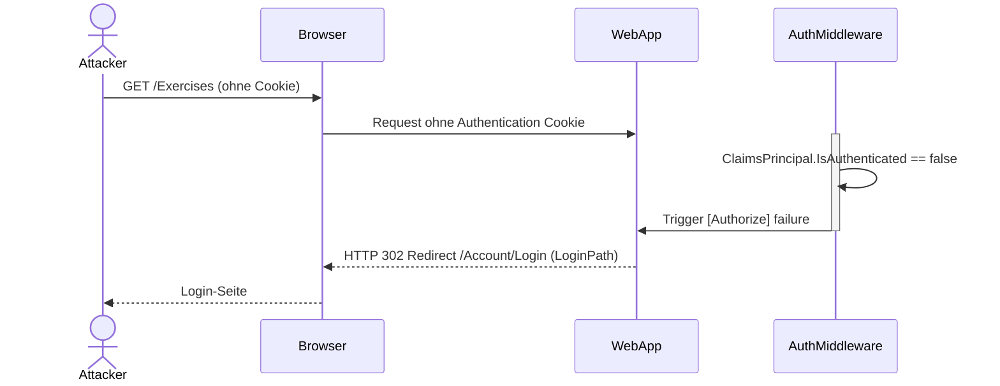

# Runtime View

## Einführung

Die Runtime-Sicht dokumentiert wichtige Szenarien und deren dynamische Abläufe zur Laufzeit. Fokus: kritische User Journeys (Login, Workout-CRUD).

## Szenario 1: User Registration & Local Login

**Beschreibung:** Benutzer registriert sich mit E-Mail und Passwort.

```mermaid
sequenceDiagram
    actor User
    participant Browser
    participant WebApp as "ASP.NET WebApp"
    participant EF as "EF Core"
    participant DB as "SQL Server"
    
    User->>Browser: Navigiert zu /Account/Register
    Browser->>WebApp: GET /Account/Register
    WebApp-->>Browser: Registrations-Formular (HTML)
    User->>Browser: Füllt Formular (Email, Password)
    Browser->>WebApp: POST /Account/Register (Form Data)
    
    activate WebApp
        WebApp->>WebApp: Validiert ModelState
        WebApp->>EF: LINQ: User.Where(u => u.Email == input.Email)
        EF->>DB: SELECT * FROM Users WHERE Email = @email
        DB-->>EF: 0 rows (User nicht vorhanden)
        
        rect rgb(200, 255, 200)
          note über WebApp: Hash Password
          WebApp->>WebApp: IPasswordHasher.HashPassword(password)
        end
        
        WebApp->>EF: DbSet<User>.Add(newUser)
        EF->>DB: INSERT INTO Users (Email, PasswordHash, Created) VALUES (...)
        DB-->>EF: ✓ Success
        EF->>WebApp: SaveChanges()
    deactivate WebApp
    
    WebApp-->>Browser: Redirect /Account/Login
    Browser-->>User: Login-Seite angezeigt
```

**Error Handling:**
- ModelState validation failed → Re-render form with errors
- Duplicate email → Constraint violation → Show error message
- DB connection timeout → 500 error page

---

## Szenario 2: Google OAuth2 Login Flow

**Beschreibung:** Benutzer loggt sich mit Google Account ein.

```mermaid
sequenceDiagram
    actor User
    participant Browser
    participant WebApp
    participant GoogleAuth as "Google OAuth2"
    participant DB
    
    User->>Browser: Klick auf "Login with Google"
    Browser->>WebApp: GET /Account/GoogleLogin
    activate WebApp
        WebApp->>GoogleAuth: Redirect to Google Authorization<br/>(client_id, redirect_uri, scope)
    deactivate WebApp
    WebApp-->>Browser: HTTP 302 Redirect to Google
    
    Browser->>GoogleAuth: Navigate to Google Login
    activate GoogleAuth
        GoogleAuth-->>Browser: Google Login UI
    deactivate GoogleAuth
    
    User->>GoogleAuth: Authenticates mit Gmail
    GoogleAuth->>GoogleAuth: Issues Authorization Code
    GoogleAuth-->>Browser: Redirect to /Account/GoogleResponse?code=...
    
    Browser->>WebApp: GET /Account/GoogleResponse?code=...
    activate WebApp
        WebApp->>GoogleAuth: Backend: Exchange Code for Token<br/>(code, client_id, client_secret)
        GoogleAuth-->>WebApp: ID Token (JWT) + AccessToken
        
        rect rgb(200, 255, 200)
          note über WebApp: Extract Claims
          WebApp->>WebApp: Parse JWT: Extract email, name, etc.
        end
        
        WebApp->>DB: LINQ: User.FirstOrDefault(u => u.Email == googleEmail)
        DB-->>WebApp: User found OR null
        
        alt User bereits registriert
            WebApp->>WebApp: Update LastLogin
        else User neu (First Google Login)  
            WebApp->>DB: Create new User record
        end
        
        WebApp->>WebApp: Create Authentication Cookie
    deactivate WebApp
    WebApp-->>Browser: Set-Cookie (AspNetCore.Cookies)
    WebApp-->>Browser: Redirect /Home
    
    Browser-->>User: Dashboard angezeigt (authenticated)
```

**Error Handling:**
- Google unreachable → Timeout → Show error
- Invalid authorization code → Token exchange fails → Redirect /error
- Network failure during code exchange → Retry logic missing (GAP-002)

---

## Szenario 3: Neue Trainingsübung erstellen (CRUD)

**Beschreibung:** Authentifizierter Benutzer erstellt neue Übung.

```mermaid
sequenceDiagram
    actor User
    participant Browser
    participant WebApp
    participant EF as "EF Core"
    participant DB
    
    User->>Browser: Klick auf "New Exercise"
    Browser->>WebApp: GET /Exercises/Create
    activate WebApp
        par Load MuscleGroups
            WebApp->>EF: DbSet<MuscleGroup>.ToList()
            EF->>DB: SELECT * FROM MuscleGroups
            DB-->>EF: [MuscleGroup List]
        and Load Other Dropdowns
            WebApp->>EF: Other lookups...
        end
    deactivate WebApp
    WebApp-->>Browser: Create-Form mit Dropdowns
    
    User->>Browser: Füllt Form (Name, MuscleGroup, Reps, Sets)
    Browser->>WebApp: POST /Exercises/Create (Form Data)
    
    activate WebApp
        rect rgb(200, 200, 255)
          note über WebApp: Authorization Check
          WebApp->>WebApp: [Authorize] — User must be authenticated
        end
        
        WebApp->>WebApp: Validiert ModelState
        WebApp->>EF: DbSet<Exercise>.Add(newExercise)
        EF->>DB: INSERT INTO Exercises (UserId, Name, MuscleGroupId, Reps, Sets, Created)
        DB-->>EF: ✓ oder ✗ (FK constraint, etc.)
        
        alt Erfolgreich
            EF->>WebApp: SaveChanges() success
            WebApp-->>Browser: Redirect /Exercises/Details/{id}
        else Fehler (FK-Verletzung, etc.)
            WebApp-->>Browser: Re-render form with error
        end
    deactivate WebApp
    
    Browser-->>User: Exercise-Details angezeigt (neu erstellt)
```

**Performance Considerations:**
- Form load könnte N+1 queries machen (Optimize mit `.Include()`)
- Insert/Update auf große Exercises-Tabelle könnte lock contention erzeugen

---

## Szenario 4: Fehlerfall: Authentifizierung fehlgeschlagen

**Beschreibung:** Benutzer versucht auf geschützte Resource zuzugreifen ohne auth.



---

## Szenario 5: Workout-Session ausführen

**Beschreibung:** Benutzer traininiert und loggt Sätze/Wiederholungen.

```mermaid
sequenceDiagram
    actor User
    participant Browser
    participant WebApp
    participant DB
    
    User->>Browser: Öffnet Dashboard
    Browser->>WebApp: GET /Home/Index
    activate WebApp
        WebApp->>DB: SELECT * FROM Workouts WHERE UserId = @userId
        DB-->>WebApp: [List of Workouts]
        WebApp->>DB: For each Workout: SELECT * FROM ExerciseSets WHERE WorkoutId = @id
    deactivate WebApp
    WebApp-->>Browser: Dashboard mit aktiven Workouts
    
    User->>Browser: Klick auf "Start Workout"
    Browser->>WebApp: GET /Workouts/{id}
    WebApp-->>Browser: Workout-Detail + Exercise-Form
    
    User->>Browser: Nutzer führt Sätze durch, loggt Reps/Weight
    loop For each exercise in workout
        Browser->>WebApp: POST /Workouts/{id}/LogSet (JSON or Form)
        activate WebApp
            rect rgb(255, 200, 200)
              note über WebApp: Validierung
              WebApp->>WebApp: Check: Reps > 0, Weight > 0
            end
            WebApp->>DB: INSERT INTO ExerciseSets (WorkoutId, ExerciseId, Reps, Weight)
        deactivate WebApp
        WebApp-->>Browser: ✓ Success JSON response
    end
    
    Browser-->>User: Workout-Session zusammengefasst
```

---

## Quality Attribute Validation (Runtime)

| Attribute | Szenario 1 | Szenario 2 | Szenario 3 | Szenario 4 | Szenario 5 |
|---|---|---|---|---|---|
| **Performance** | P95 < 200ms | P95 < 1s (OAuth) | P95 < 500ms | N/A (error) | P95 < 500ms |
| **Security** | Password Hashing | Token validation | Foreign Key auth | 401/403 response | User isolation (WHERE UserId) |
| **Reliability** | On DB error: 500 | OAuth fallback missing | FK constraint checks | Auth middleware robust | Set duplicate-detect |
| **Usability** | Form validation errors clear | Google flow redirects | Dropdowns populated | Clear redirect to login | Progress feedback |

---

## Navigation

[[index]] — Architektur-Übersicht
[[context_view]] — System Context
[[building_block_view]] — C4 Building Blocks
