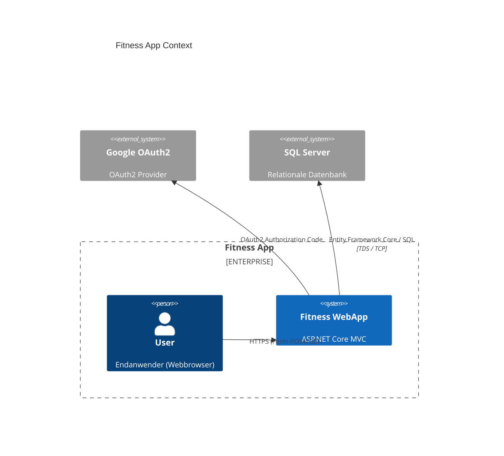

## C4 Context Diagram

## Inbound Connections

| Source | Interface | Protocol | Zweck |
|--------|-----------|----------|-------|
| Browser | Web App MVC Endpoints | HTTPS | Nutzer-Authentifikation, Workout-Management, Profile |

## Outbound Connections

| Target System | Protocol | Zweck | Pattern |
|---------------|----------|-------|---------|
| SQL Server (Datenbank) | TDS (TCP) | Persistenz von Users/Exercises/Plans | Datastore
| Google OAuth2 | HTTPS (OAuth2) | Social Login | OAuth2

## Datastore Übersicht

| Datastore | Typ | Zweck | Data Classification |
|-----------|-----|-------|---------------------|
| Fitness Database | rdbms | Benutzer-, Auth-, Workout-Daten | pii, internal |

## Integration-Patterns Zusammenfassung

- MVC Web UI ist primärer Inbound (synchronous request/response).
- Outbound SQL-DB per ORM (Entity Framework).
- Google OAuth2 als externes Auth-Provider.

## Related Documentation

- [[fitness-webapp-api]]
- [[../internal/sql-server-datastore]]
- [[../internal/google-oauth-outbound]]
- [[../internal/dependencies-overview]]
- [[../user-login-dataflow]]

[[../index]]
