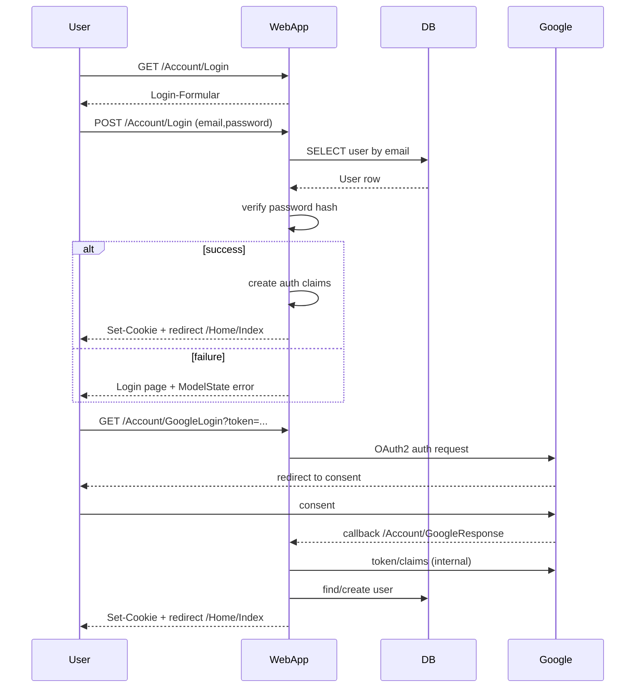

## Scenario

Ein Endbenutzer meldet sich an, entweder per E-Mail/Passwort oder Google OAuth2. Ziel ist ein erfolgreiches Session-Cookie-Login und Redirect zum Dashboard.

## Actors

- Benutzer (Browser)
- Fitness WebApp (ASP.NET Core MVC)
- SQL Server (User-Daten)
- Google OAuth2 Provider (optional)

## Flow Diagram


```

## Steps

1. GET /Account/Login lädt die Login-Ansicht.
2. POST /Account/Login überprüft Credentials im DB.
3. Bei Erfolg: Cookie-Session wird angelegt, Browser wird auf /Home/Index weitergeleitet.
4. Google-Flow: /Account/GoogleLogin startet OAuth2, /Account/GoogleResponse validiert und erstellt User/Token in DB.

## Error Paths

- Ungültige E-Mail/Passwort → Fehler auf Login-Form.
- Abgelaufener/ungültiger Registrierungstoken → Redirect /Account/Login.
- DB-Verbindungsfehler → Error-Seite (/Home/Error).

## Related APIs

- [[fitness-webapp-api]]
- [[../connections-overview]]
- [[../internal/google-oauth-outbound]]

[[../index]]
