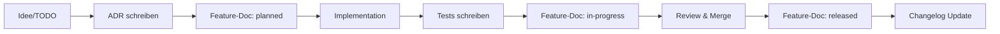

---
type: index
created: 2025-01-11
updated: 2024-11-14
tags: [features, changes, index, overview]
---

# ✨ Features & Changes

> **Für Agents:** Lies zuerst `[[_meta]]` für Feature-Dokumentations-Konventionen.

## Überblick

Dieser Bereich dokumentiert alle **implementierten Änderungen** am System:
- Neue Features (funktional & nicht-funktional)
- Breaking Changes
- Größere Refactorings
- Deprecations

Jede Feature-Doku ist verknüpft mit Tests, ADRs, und Commits.

**Aktueller Stand:** 4 Core Features dokumentiert

---

## Alle Features (chronologisch)

1. **[[2026-03-21-user-management]]** – User authentication, registration, OAuth2, RBAC
2. **[[2026-03-21-workout-tracking]]** – Exercise library, training plans, workout sessions
3. **[[2026-03-21-admin-features]]** – Admin dashboard, registration token management
4. **[[2026-03-22-image-management]]** – Image upload, storage, and retrieval

---

## Features nach Status

### 🟢 Active (4)

- [[2026-03-21-user-management]] – User Management System
- [[2026-03-21-workout-tracking]] – Workout Tracking System
- [[2026-03-21-admin-features]] – Admin Features & Management
- [[2026-03-22-image-management]] – Image Management & Storage

---

### 🟡 In Progress (0)

_Keine Features in Entwicklung._

---

### 🔵 Planned (0)

_Keine geplanten Features._

---

### 🔴 Deprecated (0)

_Keine deprecated Features._

---

## Features nach Bereich

### Documentation (1)

- [[2024-11-14-autodocs-system]] - AutoDocs Dokumentationssystem (Active)

### UI/UX (0)
_Noch keine UI-Features._

### API (0)
_Noch keine API-Features._

### Data (0)
_Noch keine Data-Features._

### Infrastructure (0)
_Noch keine Infrastructure-Features._

---

## Breaking Changes

_Noch keine Breaking Changes._

→ Breaking Changes sind Features mit `breaking_change: true`

---

## Timeline

```
2025-01 │ [Projekt initialisiert]
        │
2025-02 │ [Zukünftige Features]
        │
```

---

## Wie dokumentiere ich ein neues Feature?

### Quick Start

1. **Erstelle Datei:**
   ```bash
   # Format: YYYY-MM-DD-feature-name.md
   autodocs/features/2025-01-15-my-new-feature.md
   ```

2. **Nutze Template:**
   ```bash
   cp autodocs/templates/feature-template.md autodocs/features/2025-01-15-my-new-feature.md
   ```

3. **Fülle aus:**
   - Frontmatter: Status, Area, Tags
   - Beschreibung: Was, Warum, Wie
   - Verlinkung: Tests, ADRs, TODOs

4. **Update Index:**
   - Trage Feature in diese Datei ein
   - Update Changelog (wenn released)

### Template-Struktur

```markdown
---
type: feature
created: YYYY-MM-DD
status: planned | in-progress | released | deprecated
area: <bereich>
tags: [feature, ...]
related_adrs: []
related_tests: []
commits: []
---

# Feature: Titel

## Kurzbeschreibung
[Was wurde gemacht?]

## Motivation
[Warum?]

## Änderungen
### Code
- ...

## Tests
- [[test-link]]

## Decision Basis
- [[adr-link]]

## Related
- [[related-links]]
```

---

## Feature-Development-Workflow



---

## Statistiken

- **Total Features:** 0
- **Released:** 0 (0%)
- **In Progress:** 0 (0%)
- **Planned:** 0 (0%)
- **Deprecated:** 0 (0%)

_Letzte Aktualisierung: 2025-01-11_

---

## Tags-Übersicht

Häufig verwendete Tags:
- `#feature` – Alle Features (0)
- `#breaking-change` – Breaking Changes (0)
- `#auth` – Authentication (0)
- `#ui` – User Interface (0)
- `#api` – API Changes (0)

---

## Best Practices

### Do's ✅
- Dokumentiere Features **sobald sie geplant sind**
- Verlinke **immer** zu Tests
- Setze **klare Status**
- Update **Changelog** bei Release
- Markiere **Breaking Changes** prominent

### Don'ts ❌
- Warte nicht bis "später" mit Dokumentation
- Dokumentiere nicht jeden Bug-Fix als Feature
- Vergiss nicht die Migration-Guides bei Breaking Changes
- Ignoriere nicht veraltete Features (status: deprecated setzen)

---

## Related

- [[_meta]] – Feature-Dokumentations-Konventionen
- [[../templates/feature-template]] – Template für neue Features
- [[../adrs/index]] – Architektur-Entscheidungen
- [[../tests/index]] – Test-Dokumentation
- [[../changelog]] – Versions-Historie
- [[../index]] – Haupt-Navigation

[[../index]]
