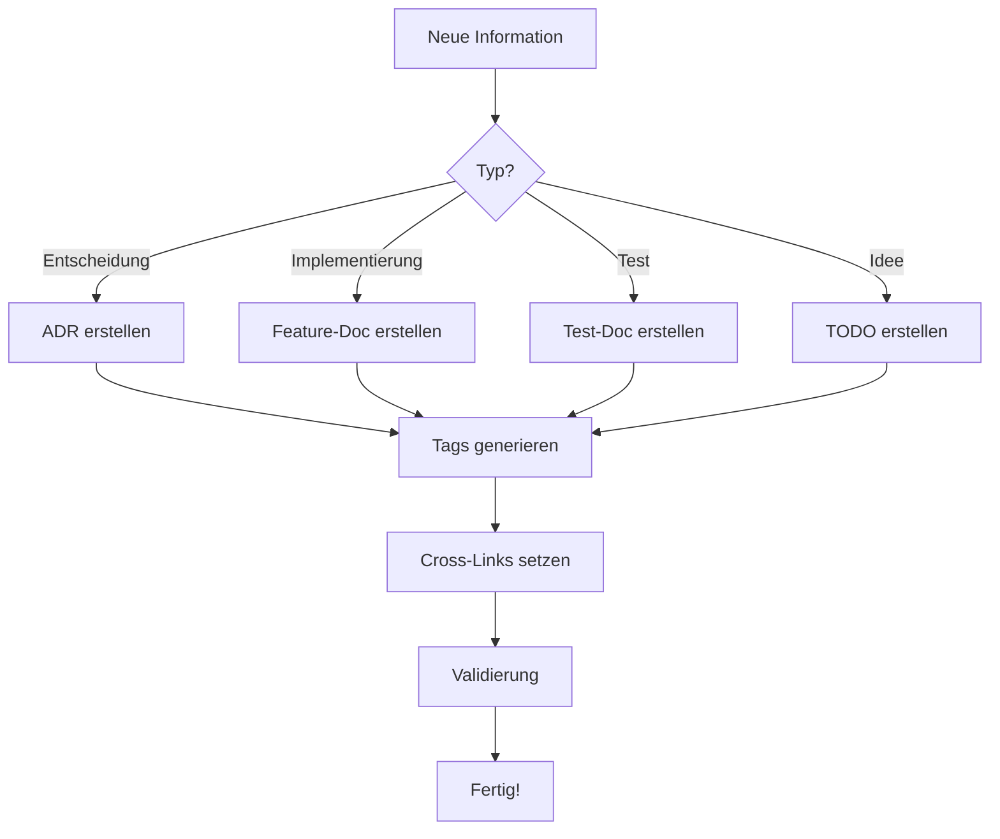

---
type: index
created: 2025-01-11
updated: 2025-01-11
tags: [docs, overview, navigation, agent-entry-point]
---

# 📚 Projektindex – Dein Einstieg ins Dokumentationssystem

> **Für Agents:** Dies ist dein Entry-Point. Lies zuerst `[[_meta]]` für globale Regeln, dann navigiere zu den spezifischen Bereichen.

## 🎯 Überblick

Dieses Projekt nutzt ein **revolutionäres Dokumentationssystem**, das Architektur, Code, Tests und TODOs nahtlos verknüpft. Die Struktur ist:
- **Obsidian-kompatibel** (YAML, Backlinks, Tags)
- **Agent-freundlich** (klare Meta-Regeln, Templates)
- **Selbsterklärend** (jeder Ordner dokumentiert sich selbst)
- **Skalierbar** (kopierbar in jedes Projekt)

### Repository-Struktur

**Core (Required):**
```
/autodocs/
├── _meta.md           ✅ Globale Konventionen (lies mich zuerst!)
├── index.md           ✅ Dieser Einstieg
├── changelog.md       ✅ Automatisch generiert
├── /adrs/             ✅ Architekturentscheidungen
├── /features/         ✅ Implementierte Änderungen
├── /tests/            ✅ Test-Dokumentation (+ e2e/, unit/)
├── /todo/             ✅ Backlog & Tech Debt
├── /templates/        ✅ Wiederverwendbare Templates
├── /guides/           ✅ How-To & Best Practices
└── /agents/           ✅ System Agent Prompts
```

**Optional Extensions:**
```
├── /architecture/     ⚙️  iSAQB Architecture Docs
├── /domain/           ⚙️  Domain Knowledge & Business Logic
├── /ui/               ⚙️  UI/UX Documentation
├── /ci/               ⚙️  CI/CD & Deployment
├── /blackbox/         ⚙️  External Interface Documentation
└── /questions/        ⚙️  Clarification Questions
```


## 🗂️ Hauptbereiche

### Core Folders (Required) ✅

#### 🏛️ [[adrs/index|Architektur-Entscheidungen (ADRs)]]
Dokumentiert **warum** wir technische Entscheidungen treffen.
- Format: `adr-XXX-titel.md`
- Status: `accepted`, `rejected`, `superseded`
- **Niemals löschen**, immer weiterentwickeln

#### ✨ [[features/index|Features & Änderungen]]
Dokumentiert **was** implementiert wurde.
- Format: `YYYY-MM-DD-titel.md`
- Verknüpft mit: Tests, Commits, Tickets
- Status: `planned`, `in-progress`, `released`, `deprecated`

#### 🧪 [[tests/index|Test-Dokumentation]]
Dokumentiert **wie** wir Qualität sichern.
- Unit-Tests: `[[tests/unit/index]]`
- E2E-Tests: `[[tests/e2e/index]]`
- Coverage: `[[tests/coverage]]`

#### 📋 [[todo/index|TODOs & Tech Debt]]
Dokumentiert **was noch fehlt**.
- Priorisiert: `#prio/high`, `#prio/medium`, `#prio/low`
- Kategorisiert: `#cat/tech-debt`, `#cat/enhancement`, `#cat/bug`
- Workflow: TODO → Feature/ADR

#### 📚 [[templates/index|Templates]]
Wiederverwendbare Vorlagen für neue Dokumente.
- ADR, Feature, Test, TODO Templates

#### 📖 [[guides/index|Guides]]
How-To-Guides und Best Practices.
- Agent Workflow, Tag Taxonomy

#### 🤖 [[agents/index|System Agents]]
Agent-Prompts für Selbstverwaltung.
- Initializer, Blackbox, Architect, Auditor, etc.

---

### Optional Extensions ⚙️

#### 🏗️ [[architecture/index|Architecture]] (iSAQB)
Formale Architektur-Dokumentation.
- **Wann:** Complex architecture, compliance needed
- **Agent:** `40_architect.yaml`

#### 🎯 [[domain/index|Domain Knowledge]]
Domain-Driven Design & Business Logic.
- **Wann:** DDD, complex domain, bounded contexts
- **Agent:** Part of `10_initializer.yaml`

#### 🎨 [[ui/index|UI/UX Documentation]]
Design-System & Component-Library.
- **Wann:** Frontend-heavy, design system exists
- **Agent:** Manual/custom

#### 🚀 [[ci/index|CI/CD]]
Build, Deploy, Automation.
- **Wann:** Complex pipelines, multiple environments
- **Agent:** Manual/custom

#### 🔌 [[blackbox/index|External Interfaces]]
API Documentation & Integrations.
- **Wann:** Many external APIs, public API
- **Agent:** `20_blackbox.yaml`

#### ❓ [[questions/index|Clarification Questions]]
Manage unclear requirements.
- **Wann:** Knowledge gaps, stakeholder input needed
- **Agent:** `30_questionnaire_clarifier.yaml`

## 🚀 Schnellstart

### Für Menschen: Wie dokumentiere ich eine Änderung?

#### 1. Architektur-Entscheidung getroffen?
```bash
# Erstelle neue ADR
autodocs/adrs/adr-001-meine-entscheidung.md
```
Nutze Template: `[[templates/adr-template]]`

#### 2. Feature implementiert?
```bash
# Erstelle neue Feature-Doku
autodocs/features/2025-01-11-mein-feature.md
```
Nutze Template: `[[templates/feature-template]]`

#### 3. Tests geschrieben?
```bash
# Dokumentiere Tests
autodocs/tests/unit/test-beschreibung.md
```
Update `[[tests/coverage]]`

#### 4. Idee oder Tech Debt?
```bash
# Erstelle TODO
autodocs/todo/todo-beschreibung.md
```
Nutze Template: `[[templates/todo-template]]`

### Für Agents: Dein Workflow



**Detaillierter Guide:** `[[guides/agent-workflow]]`

## 📖 Glossar

| Begriff | Bedeutung | Beispiel |
|---------|-----------|----------|
| **ADR** | Architecture Decision Record | `adr-001-use-postgresql.md` |
| **Feature-Doc** | Dokumentation einer Änderung | `2025-01-11-login-system.md` |
| **Test-Doc** | Test-Beschreibung + Coverage | `unit/auth-service.md` |
| **TODO** | Offene Aufgabe oder Tech Debt | `refactor-legacy-code.md` |
| **Tag** | Kategorisierung via Hashtag | `#cmp/pdf-renderer` |
| **Backlink** | Obsidian-Verweis | `[[../index]]` |
| **Frontmatter** | YAML-Metadaten | `type: adr` |

## 🔗 Navigation & Tags

### Häufig genutzte Tags
- `#status/active` – Aktive Komponenten
- `#prio/high` – Hohe Priorität
- `#test/coverage-low` – Niedrige Test-Abdeckung
- `#tech-debt` – Technische Schulden
- `#breaking-change` – Breaking Changes

### Navigation-Patterns
- **Bottom-Up:** Von spezifischer Datei via Backlinks zum Index
- **Top-Down:** Von Index via Forward-Links zu Details
- **Tag-basiert:** Alle Docs mit `#cmp/auth` finden
- **Graph-View:** Obsidian zeigt Verknüpfungen visuell

## 🛠️ Maintenance & Automation

### Automatisierbare Tasks
- [ ] Changelog aus Commits generieren
- [ ] Coverage-Reports aktualisieren
- [ ] Broken-Links prüfen
- [ ] Tag-Konsistenz validieren
- [ ] Orphaned Docs finden

### Regelmäßige Reviews
- **Wöchentlich:** TODOs priorisieren
- **Monatlich:** Test-Coverage prüfen
- **Quarterly:** ADRs auf Aktualität prüfen

## 📚 Weitere Ressourcen

### Guides
- [[guides/agent-workflow]] – Detaillierter Agent-Workflow
- [[guides/tag-taxonomy]] – Vollständige Tag-Übersicht
- [[guides/obsidian-setup]] – Obsidian optimal konfigurieren
- [[guides/automation]] – Automatisierung einrichten

### Templates
- [[templates/adr-template]] – ADR-Vorlage
- [[templates/feature-template]] – Feature-Vorlage
- [[templates/test-template]] – Test-Vorlage
- [[templates/todo-template]] – TODO-Vorlage

### Meta
- [[_meta]] – Globale Konventionen
- [[changelog]] – Versions-Historie
- [[roadmap]] – Zukunftspläne

## 🤝 Contribution

Neue Dokumentation? Folge diesem Flow:
1. Lies `[[_meta]]` für Regeln
2. Wähle passendes Template aus `[[templates/_meta]]`
3. Setze Frontmatter korrekt
4. Verlinke bidirektional
5. Nutze konsistente Tags
6. Commit mit Conventional Commit Message

## ❓ Hilfe & Support

- **Für Agents:** Start mit `[[guides/agent-workflow]]`
- **Für Menschen:** Start mit diesem Index
- **Bei Unklarheit:** Siehe `[[_meta]]` oder erstelle ein TODO

---

**Letztes Update:** 2025-01-11  
**Version:** 1.0.0  
**Maintainer:** Autodocs System

[[_meta]]
